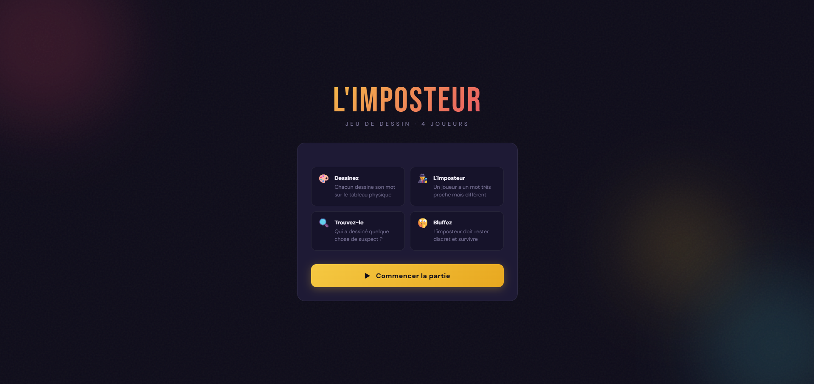

<h1 align="center">
  
</h1>


---

# UnderCoverDraw — Draw and find the undercover

## Aperçu
Jeu de société **dessin & déduction** inspiré d'*Undercover*. La majorité des joueurs reçoit un **mot A**, tandis que l'imposteur reçoit un **mot B** très proche visuellement. Chacun dessine son mot de façon **simple et minimaliste** (style icône / pictogramme / bonhomme-bâton) : comme les deux croquis se ressemblent énormément, l'imposteur peut se fondre dans la masse. À la fin, tout le monde vote pour démasquer celui qui n'avait pas le bon mot.

Le projet comprend **un jeu web jouable** (`undercover.html`) qui distribue les rôles et les mots sur un seul appareil que l'on se passe entre joueurs, ainsi qu'une **base de 344 couples de mots** « qui se ressemblent en dessin », regroupés par **forme** ou **famille** pour qu'on retrouve facilement un piège visuel.

## Fonctionnalités

### Jeu web (`undercover.html`)
- **Jeu « passe-l'appareil »** pour **4 joueurs** : un seul écran circule, chacun découvre son mot en privé
- Distribution automatique des rôles : un imposteur tiré au hasard reçoit le mot B, les autres le mot A
- Aucun indice de rôle au moment de la révélation : impossible de savoir si l'on est l'imposteur tant que les dessins ne sont pas comparés
- Écran de résultat révélant le **mot commun**, le **mot imposteur** et le rôle de chaque joueur
- Interface 100 % en français, responsive, sans dépendance ni back-end
- Les mots sont tirés directement de la base **`couples_de_mots.json`** (source unique, chargée via `fetch`)

### Concept de jeu
- **Variante « mot caché »** : la majorité reçoit le mot A, l'imposteur reçoit le mot B (très proche). Comme les dessins se ressemblent, l'imposteur peut bluffer
- **Jeu de dessin-piège** : un joueur tire un couple, dessine *l'un* des deux mots de façon simple ; les autres doivent deviner lequel des deux c'est — le piège vient de la ressemblance
- **Échauffement Pictionary** : idéal pour des manches rapides où le croquis minimaliste suffit
- Les couples des sections **croissant**, **objets longs**, **ciel** et **formes & symboles** sont les plus « traîtres » — leur croquis est quasi identique

### Base de couples de mots
- **344 couples** dont le dessin simplifié se ressemble fortement
- Lecture : `Mot A / Mot B` — les deux donnent (à peu près) le même croquis minimaliste
- Regroupés en **20 catégories** par forme ou famille (formes rondes, croissant, objets longs, triangles & cônes, animaux, oiseaux, insectes, fruits & légumes, plantes & fleurs, météo & espace, outils, objets du quotidien, vêtements, bâtiments, transports, corps humain, formes & symboles…)
- **Source unique** : tout est centralisé dans `couples_de_mots.json`, exploité aussi bien par le jeu web que par n'importe quel script

### Format des données
- Format JSON simple : chaque catégorie a un `nom` et une liste de `couples`, chaque couple étant un tableau `[mot_a, mot_b]`
- Facile à parser pour tirer un couple au hasard, filtrer par catégorie ou par niveau de difficulté

## Technologies
- **HTML / CSS / JavaScript** — jeu web jouable, sans framework ni back-end (`undercover.html`)
- **JSON** — base de données de couples de mots, source unique (`couples_de_mots.json`)

## Installation

Clonez le dépôt :

```bash
git clone https://github.com/Pierre-Portfolio/undercoverdraw.git
cd undercoverdraw
```

Aucune dépendance n'est requise.

### Lancer le jeu

Le jeu charge ses mots via `fetch('couples_de_mots.json')`, il doit donc être servi par un serveur web (et non ouvert en double-clic `file://`).

- **En local** : depuis le dossier du projet,

  ```bash
  python -m http.server 8000
  ```

  puis ouvrez `http://localhost:8000/undercover.html`.
- **En ligne** : déployez le dépôt sur **GitHub Pages** — `undercover.html` est directement jouable.

## Structure du projet
```
UnderCoverDraw/
  README.md            → Présentation du projet
  undercover.html      → Jeu web jouable (passe-l'appareil, 4 joueurs)
  couples_de_mots.json → Base de 344 couples (format [mot_a, mot_b] par catégorie) — source unique
  assets/
    images/github/     → Images README
```

## Schéma des données (JSON)

```json
{
  "description": "Couples de mots dont le dessin simplifie se ressemble. Format: [mot_a, mot_b].",
  "categories": [
    {
      "nom": "Formes rondes (le même rond)",
      "couples": [
        ["Soleil", "Tournesol"],
        ["Pomme", "Tomate"],
        ["Orange", "Mandarine"]
      ]
    }
  ]
}
```

## Comment l'utiliser

- **Jeu web (recommandé)** : ouvrez `undercover.html` (servi par un serveur web / GitHub Pages). Entrez les 4 prénoms, passez l'appareil de joueur en joueur pour la révélation, dessinez, puis révélez les rôles.
- **Jeu de dessin-piège** : un joueur tire un couple, dessine *un* des deux mots de façon simple ; les autres devinent lequel c'est.
- **Variante « mot caché » (Undercover)** : la majorité reçoit le mot A, l'imposteur le mot B (très proche). Les dessins se ressemblant, l'imposteur peut se fondre dans la masse jusqu'au vote final.
- **Échauffement Pictionary** : parfait pour des manches rapides où le dessin minimaliste suffit.

> Astuce : piochez dans les sections **croissant**, **objets longs**, **ciel & espace** et **formes & symboles** pour les pièges les plus difficiles.

## Aperçu de l'interface


## Auteur
- [Pierre-Portfolio](https://github.com/Pierre-Portfolio/)

---

<p align="center">Projet réalisé en 2026.</p>
